# Visual Studio Code

## Autors: 

* Alien Embarec Riadi {alu0101035406@ull.edu.es}
* Felipe Álvarez Avaria {alu0100969535@ull.edu.es}

## Index:

1) [What is VS Code?](#-1.-what-is-vs-code?)
    * a) [¿What is an IDE?](#-a-¿what-is-an-ide?)
    * b) [VSC History](#-b-vsc-history)
    * c) [VSC Language Support](#-c-vsc-language-support)
    * d) [VS Versions](#-d-vs-versions)

2) [Installation of VSC in Linux and Windows OS](#-2.-installation-of-vsc-in-linux-and-windows-os)
    * a) [How to Install in Linux](#-a-how-to-install-in-linux)
    * b) [How to Install VSC in Windows](#-b-how-to-install-vsc-in-windows)

3) [Basic Use of VSC](#-3.-basic-use-of-vsc)
    * a) [Main Interface](#-a-main-interface)
    * b) [How to create a project](#-b-how-to-create-a-project)
    * c) [Color Theme](#-c-color-theme)
    * d) [Panel](#-d-panel)
    * e) [IntelliSense and Emmet](#-e-intellisense-and-emmet)
    * f) [Multi-selector](#-f-multi-selector)
    * g) [How to run code on VS Code](#-g-how-to-run-code-on-vs-code)
    * h) [Editor Layout](#-h-editor-layout)
    * i) [Code formatting](#-i-code-formatting)
    * j) [Code refactoring](#-j-code-refactoring)

4) [Extensions](#-4.-extensions)
    * a) [Mocha-sidebar](#-a-mocha-sidebar)
    * b) [Prettier](#-b-prettier)
    * c) [Git Lens](#-c-git-lens)
    * d) [Vim](#-d-vim)
    * e) [Slack](#-e-slack)
    * f) [Trello](#-f-trello)

5) [JSDoc with VSC](#-5.-jsdoc-with-vsc)
6) [JS Linting in VSC](#-6.-js-linting-in-vsc)
    * a) [Definition](#-a-definition)
    * b) [Why using a Linter?](#-b-why-using-a-linter?)
    * c) [Linting in VSC](#-c-linting-in-vsc)
    * d) [ESLint](#-d-eslint)
    * e) [Installing ESLint](#-e-installing-eslint)
    * f) [Configure ESLint](#-f-configure-eslint)
    * g) [Using ESLint](#-g-using-eslint)

7) [JS Debugging in VSC](#-7.-js-debugging-in-vsc)
    * a) [Debugger](#-a-debugger)
    * b) [Debug View](#-b-debug-view)
    * c) [Entering Debug Mode](#-c-entering-debug-mode)
    * d) [Breakpoints](#-d-breakpoints)

8) [Remote editing in IaaS VM](#-8.-remote-editing-in-iaas-vm)
    * a) [Introduction](#-a-introduction)
    * b) [Setup requirements](#-b-setup-requirements)
    * c) [Setup](#-c-setup)
    * d) [Key pair based authentication](#-d-key-pair-based-authentication)
    * e) [Login](#-e-login)
    * f) [Considerations](#-f-considerations)

9) [Source Control](#-9.-source-control)

    * a) [git integration](#-a-git-integration)
    * b) [Adding a remote](#-b-adding-a-remote)
    * c) [GitHub integration](#-c-github-integration)

10) [Keyboard Shortcuts in VSC](#-10.-keyboard-shortcuts-in-vsc)

    * a) [Introduction](#-a-introduction-1)
    * b) [Editing keyboard shortcuts](#-b-editing-keyboard-shortcuts)
    * c) [Custom keyboard shortcuts](#-c-custom-keyboard-shortcuts)
    * d) [Cheatsheets](#-d-cheatsheets)
    * e) [Keymaps](#-e-keymaps)

11) [Bibliography](#-11.-bibliography)

---

## 1. What is VS Code?

Visual Studio Code is a source-code IDE  developed by Microsoft for Windows, Linux and macOS. It includes support for debugging, embedded Git control, syntax highlighting, and other important features.

### a) ¿What is an IDE?

An Integrated Development Environment(IDE), is a software application that provides comprehensive facilities to computer programmers for software development.

### b) VSC History

On November 18, 2015, Visual Studio Code was released under the MIT License and its [source code](https://github.com/microsoft/vscode) posted to GitHub.

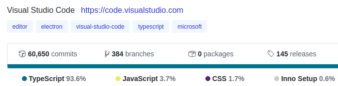

### c) VSC Language Support

Visual Studio Code is a source code editor that can be used with a variety of programming languages.

VSC  provides default support for JS,CSS,HTML and TypeScript. Other languages support can be added via extensions.

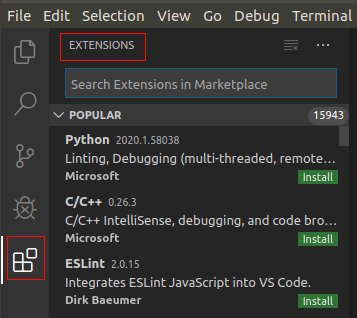 

### d) VS Versions

There are several versions of microsoft visual studio availables. We're going to work with Visual Studio Code, a code writing and debugging oriented version.

Although later we'll see that you can add features to the IDE with the extensions.

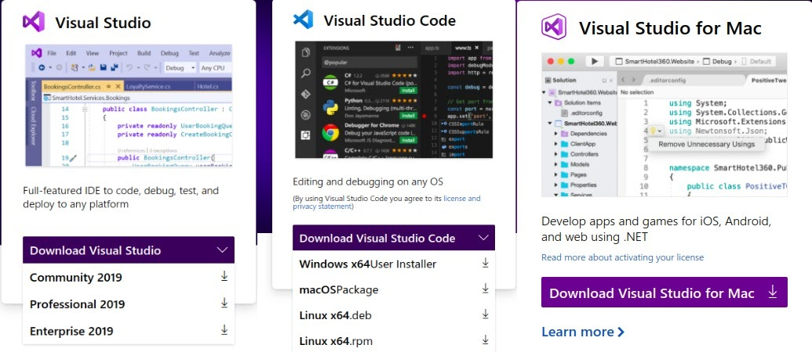 

## 2. Installation of VSC in Linux and Windows OS

 

Visual Studio Code is available for three main Operating Systems: Linux, Windows and macOS.
Two versions: stable releases and for Beta-testers(Insiders).

Visual Studio Code is available for three main Operating Systems: Linux, Windows and macOS.

Two versions: stable releases and for Beta-testers(Insiders).

### a) How to Install in Linux

Make sure you are logged in Linux as a user with sudo privileges.
First, we go to the official Visual Studio Code [page](https://code.visualstudio.com/) and install the executable file.

Depending on your Linux Operating System distribution, you will have to install the package for Debian or for RPM.
See this VSC official guide for [installation in Linux](https://code.visualstudio.com/docs/setup/linux#_installation).

### b) How to Install VSC in Windows

Download the executable from the VSC page. Then you have to start the installation wizard for Windows.

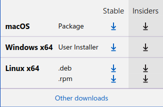 

## 3. Basic Use of VSC

### a) Main Interface

Welcome Window when code-editor  is opened for first time.

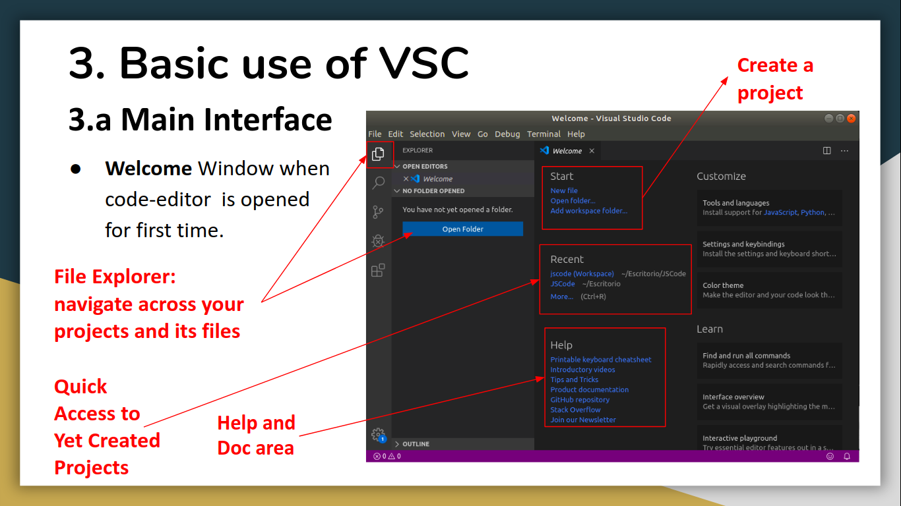

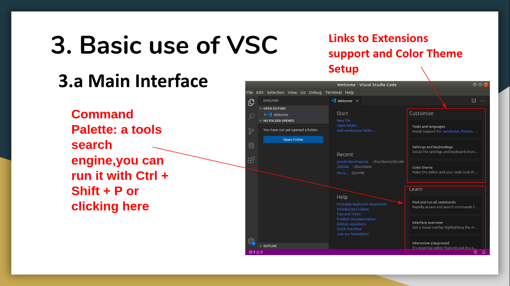 

Command Palette

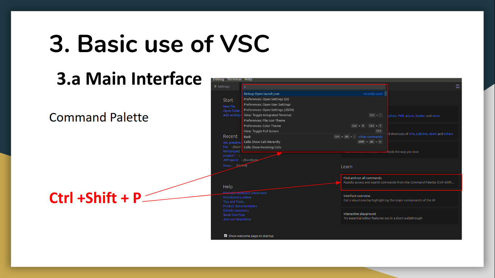

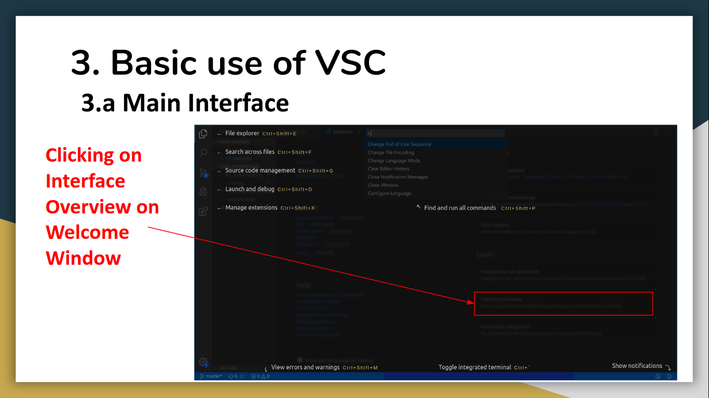 

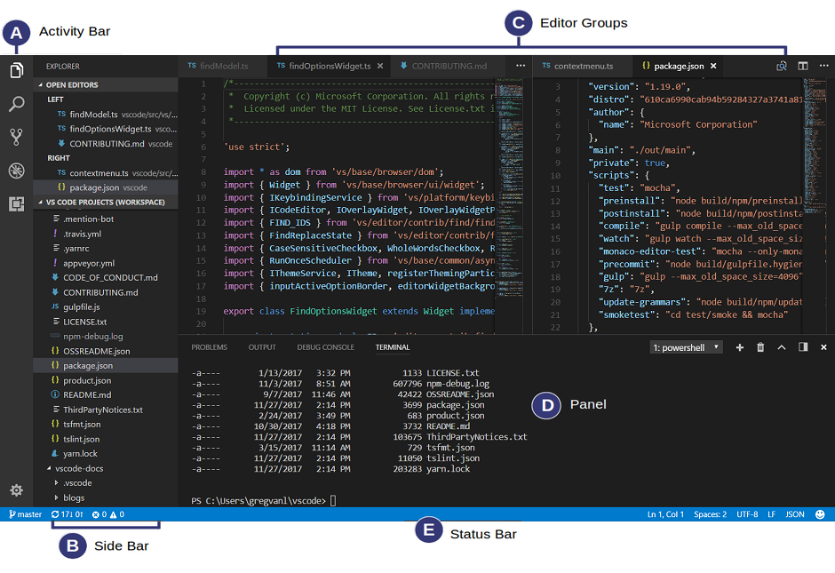 

### b) How to create a project

User settings: apply to each vsc instance opened.

Workspace settings: apply only to one or more projects.

 

For create a project go to File > Open Folder > Open existing folder o create a new one . 

These step can also be done on  Welcome Page on Start  > Open folder.

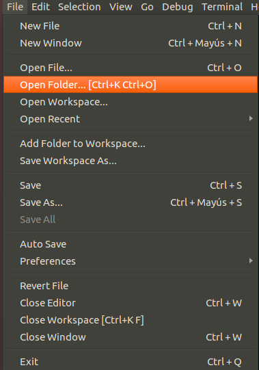

Each project has a workspace, where the specific settings of project are configured. 

For save workspace, save your changes with Ctrl+S, then go to File > Save Workspace As and choose the location of these file. As it is associated to the project, it should be saved in the project folder.

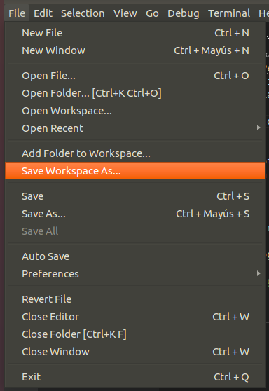

You can see [here](https://www.youtube.com/watch?v=aMjEXa-yXnY&feature=youtu.be) a demo made by use about multiroot workspaces

### c) Color Theme

Go to Command Palette > Color Theme, also Ctrl + K Ctrl + T

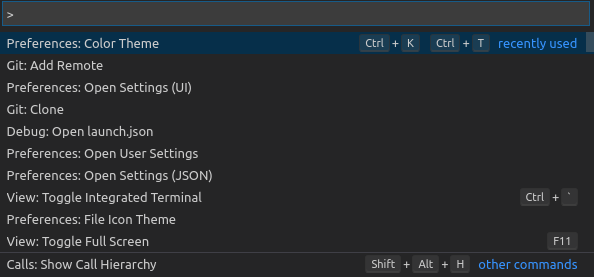

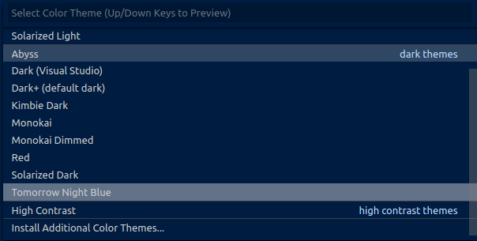

### d) Panel

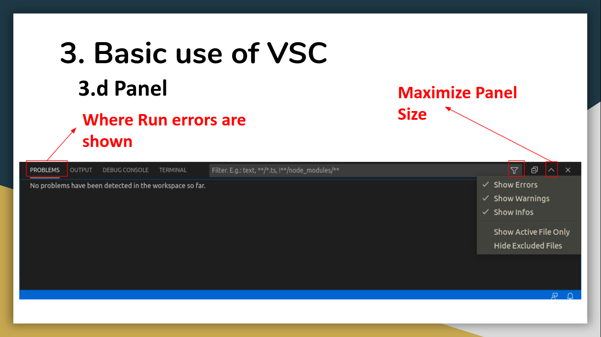

Additional commands: scroll Up/Down (Shift + Fn + Up/Down)

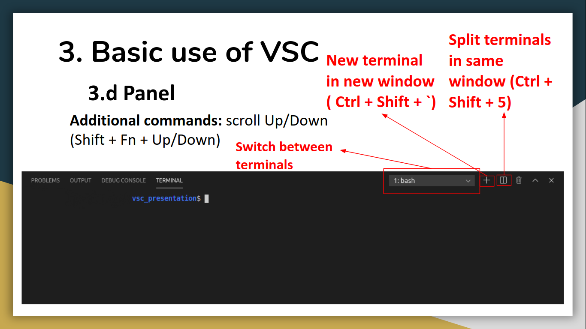

### e) IntelliSense and Emmet

Type Inference, JSDoc: variables and function names and more.

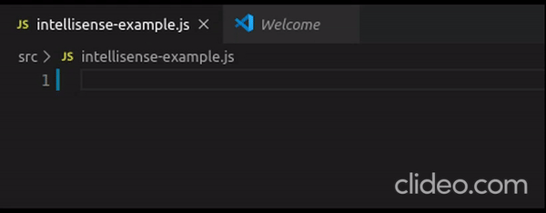

Emmet: 	Snippet expansion (1).

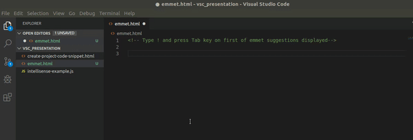

Emmet : Abbreviatons (2).

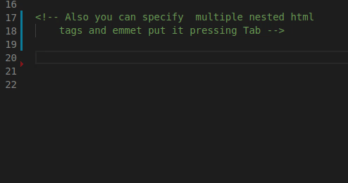

### f) Multi-selector

For example: rename multiple variables. Select first occurrence + ctrl  + d

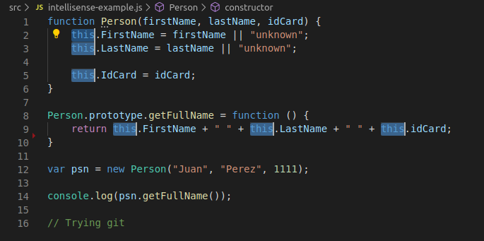

Other ways: multiple selectors, select first occurrence and then left click + alt for add more occurrences.

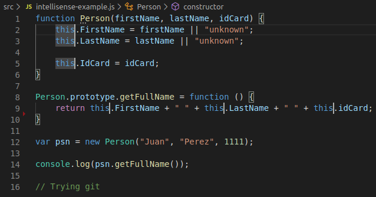

### g) How to run code on VS Code

There are many options:

In Debug/Run without Debugging

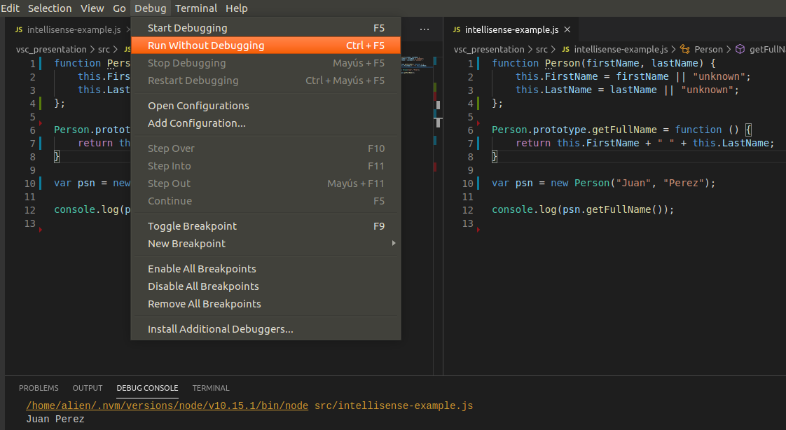

In Terminal > Run active file

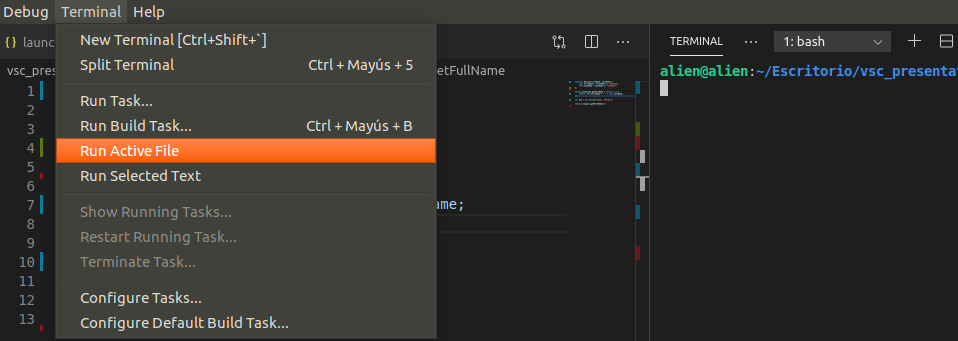

As we will be using Node.js, another way of run code is define a Task going to package.json

In scripts hash, write a new task providing a key name and what should be done when the task is applied. For example: "start": "node ./src/multiSelector.js"

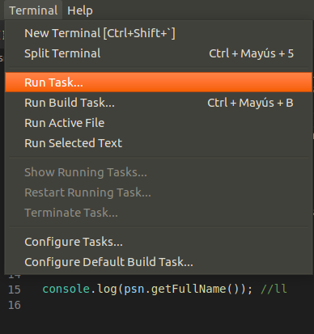

Now, go to the file you want to execute and in status bar, click on Terminal > Run Task

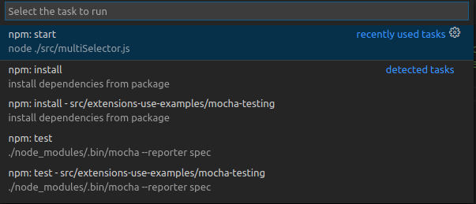

For HTML files, you can use  Open in browser extension

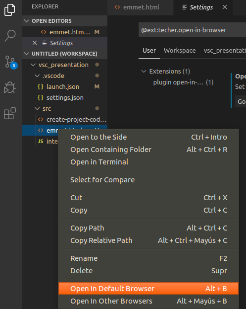

### h) Editor Layout

Tools bar, View/Editor Layout

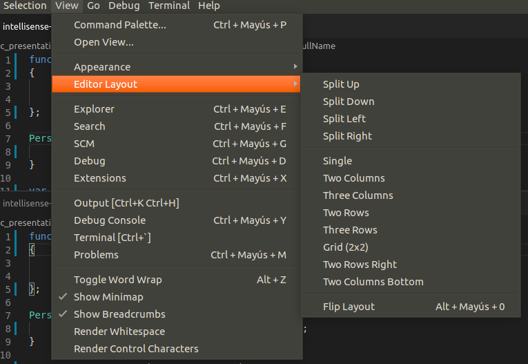

Toggle editor layout, horizontal/vertical Shift + Alt + 0

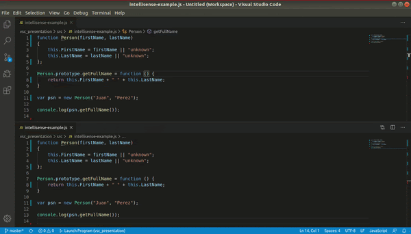

### i) Code formatting

Format Document, 
Ctrl + Shift + I

Format selection,
Ctrl + K Ctrl + F

### j) Code refactoring 
#### Rename Symbol

Rename selected variable and all similar occurrences.

#### Extract Variable

#### Extract Method
#### Peek Definition

## 4. Extensions

### a) Mocha-sidebar
### b) Prettier
### c) Git Lens
### d) Vim
### e) Slack
### f) Trello

## 5. JSDoc with VSC

## 6. JS Linting in VSC

### a) Definition
### b) Why using a Linter?
### c) Linting in VSC
### d) ESLint
### e) Installing ESLint
### f) Configure ESLint
### g) Using ESLint

## 7. JS Debugging in VSC

### a) Debugger
### b) Debug View
### c) Entering Debug Mode
### d) Breakpoints

## 8. Remote editing in IaaS VM

### a) Introduction
### b) Setup requirements
### c) Setup
### d) Key pair based authentication
### e) Login
### f) Considerations

## 9. Source Control

### a) git integration
### b) Adding a remote
### c) GitHub integration

## 10. Keyboard Shortcuts in VSC

### a) Introduction
### b) Editing keyboard shortcuts
### c) Custom keyboard shortcuts
### d) Cheatsheets
### e) Keymaps

## 11. Bibliography